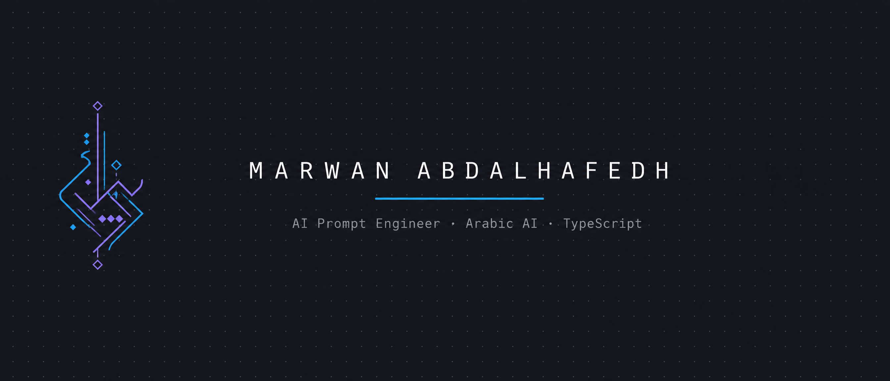
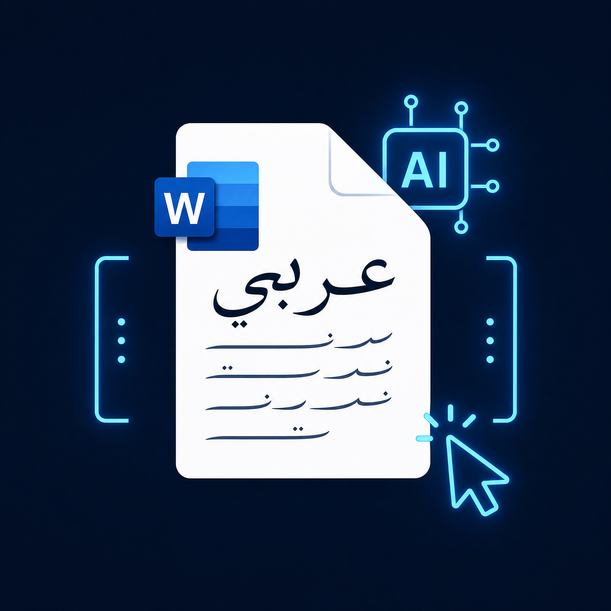

  

<h1 align="center">
  <b>Marwan Abdalhafedh</b> 
  <code>AI Prompt Engineer</code> · <code>Arabic AI Systems</code> · <code>TypeScript & MCP</code>
</h1>

  
  
  
  
  

---

> ### 📍 Iraq · 🌐 English + العربية
> I design and ship software that lets AI speak **Arabic** natively. My work sits at the intersection of **prompt engineering**, **Arabic language processing**, and **protocol-driven tooling** — turning language models into reliable, production-grade systems for real-world workflows.
>
> أعمل في تصميم وبناء أنظمة تتيح للذكاء الاصطناعي التحدث بالعربية بطلاقة — من هندسة الموجهات ومعالجة اللغة العربية إلى خوادم MCP مفتوحة المصدر على npm.

---

<h2 align="center">◆ Selected Work ◆</h2>

<table align="center" border="0" cellpadding="14" cellspacing="0">
  <tr>
    <td align="center" width="33%">
      
      <h3 align="center"><a href="./mcp-arabic-ms-word">mcp-arabic-ms-word</a></h3>
      
MCP Server · Arabic Word Automation

      

        
        
        
      

    </td>
    <td align="center" width="33%">
      
      <h3 align="center"><a href="./mcp-flutter-apk-injector">mcp-flutter-apk-injector</a></h3>
      
MCP Server · APK Reverse Engineering

      

        
        
        
      

    </td>
    <td align="center" width="33%">
      
      <h3 align="center"><a href="./Aqeeda">Aqeeda+</a></h3>
      
Flutter App · Islamic Education

      

        
        
        
      

    </td>
  </tr>
</table>

###  [mcp-arabic-ms-word](./mcp-arabic-ms-word) — Arabic-first Word Automation

A **Model Context Protocol** server that lets AI agents author, inspect, and repair Microsoft Word documents with **full Arabic and RTL support**. Thirteen specialized tools handle docx decompression, internal XML surgery, Arabic text reformatting (shaping, digit normalization, Alef/Ya standardization), and template injection. Published on [npm](https://www.npmjs.com/package/mcp-arabic-ms-word) and registered in the Glama MCP registry, targeting Tier-A documentation standards.

خادم MCP يمكّن وكلاء الذكاء الاصطناعي من إنشاء وفحص وإصلاح مستندات Word **بدعم كامل للعربية واتجاه RTL**: ثلاثة عشر أداة متخصصة لفك ضغط docx، الجراحة على XML الداخلي، إصلاح النصوص العربية، وحقن القوالب.

---

###  [mcp-flutter-apk-injector](./mcp-flutter-apk-injector) — Android Binary Analysis for AI Agents

An enterprise-grade MCP server for **automated APK reverse engineering**: Dalvik/ART bytecode analysis, Smali refactoring, native JNI tracing, and Flutter runtime injection. Powered by the **Hermes+ memory engine** with persistent session telemetry, searchable patch history, and zero-argument prompt resilience. Built with TypeScript, Vitest, ESLint, and semantic release cycles — registered on [npm](https://www.npmjs.com/package/mcp-flutter-apk-injector).

خادم MCP بمستوى احترافي لأتمتة **الهندسة العكسية لتطبيقات أندرويد**: تحليل Dalvik/ART، إعادة هيكلة Smali، تتبع JNI، وحقن Flutter Runtime، مدعوم بمحرك ذاكرة Hermes+.

---

###  [Aqeeda+](./Aqeeda) — Islamic Studies Platform

A **Flutter + Firebase** mobile platform for university students of **Islamic Theology and Thought**. Features an academic feed, the Holy Quran, an FM radio module with **117 stations**, video lessons, a Hijri calendar, and push notifications — serving an academic community beyond the repository.

منصة تعليمية بهاتف Flutter وFirebase لطلاب **قسم العقيدة والفكر الإسلامي**: feed أكاديمي، قرآن كريم، راديو FM بـ117 محطة، دروس مرئية، تقويم هجري، وإشعارات فورية.

---

  

<h2 align="center">◆ Expertise ◆</h2>

<table align="center" width="85%">
  <tr align="center">
    <th><b>🎯 Prompt Engineering</b></th>
    <th><b>🔤 Arabic NLP</b></th>
    <th><b>⚡ TypeScript / Node.js</b></th>
    <th><b>📱 Mobile & Apps</b></th>
    <th><b>🌐 Open Source</b></th>
  </tr>
  <tr align="center">
    <td>Agent system prompts (Claude, Gemini, Codex) · MCP tool annotation · Evaluation-driven design</td>
    <td>RTL processing · Arabic shaping & normalization · docx XML surgery</td>
    <td>MCP servers · npm publishing · Vitest · ESLint</td>
    <td>Flutter · Firebase · OneSignal · Offline-first media</td>
    <td>MIT releases · Glama registry · Bilingual documentation</td>
  </tr>
</table>

<h2 align="center">◆ Tools & Technologies ◆</h2>

  
  
  
  
  
  
  
  
  
  
  

---

<h2 align="center">◆ Let's Connect ◆</h2>

  <a href="mailto:marwan.a.discord@gmail.com">📧 Email</a> ·
  <a href="https://marwandevspace.github.io/Marwan.dev/">🌍 Website</a> ·
  <a href="https://t.me/MarwanAIDev">✈️ Telegram</a> ·
  <a href="https://www.instagram.com/mo.os/">📸 Instagram</a> ·
  📍 Iraq

Licensed under MIT · Bilingual by design — this profile is written in English and العربية

